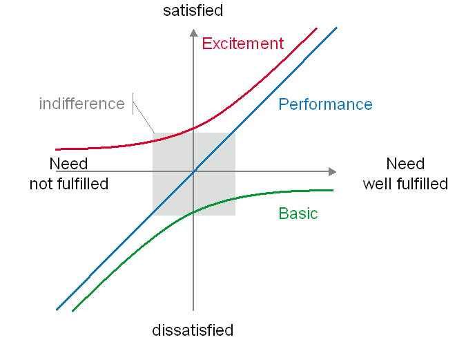

# Chapter6.4 - 고객의 총 만족도를 높이자
---

## 요구라고 다 같은 요구가 아니다
- 요구사항은 개발자 관점과 고객 관점이 다름
- 고객의 만족도를 높이는 것에 초점을 맞춰야 함

## 카노 모델로 본 요구의 세 가지 종류

1. Basic: 기본 기능은 요구를 충족하지 못하면 고객이 불만족하지만, 요구를 만족했다고 해서 고객 만족도가 크게 오르지 않는 유형

2. Performance: 기능의 성능은 요구를 충족할수록 고객이 만족하고, 충족하지 않으면 고객이 불만족하는 유형

3. Excitement: 고객이 그다지 원하지 않았던 것이기에 충족하지 못해도 불만은 없는데, 만약 충족한다면 크게 만족하는 경우

참고문헌: [개발자의 글쓰기](http://www.kyobobook.co.kr/product/detailViewKor.laf?ejkGb=KOR&mallGb=KOR&barcode=9791158391744&orderClick=LAG&Kc=#N)